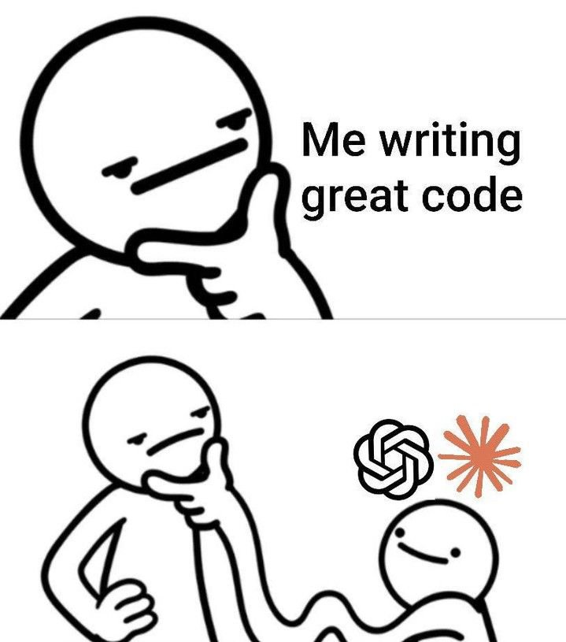

<h1 align="center">Hey, I'm Hossein 👋</h1>
<h3 align="center">Vibe Coder · I describe the idea, the machine writes the code 😅</h3>

  
  
  

  

---

### 🚀 About Me

I don't write boilerplate — I describe intent and let the machine catch up.

- 🧠 **Vibe Coder** — I think in features, not in syntax.
- ⚡ **AI is my pair** — rough idea in, working software out.
- 🛠️ I care about **clean architecture, real-time systems, and shipping things people actually use.**
- 🔒 Privacy-first & security-conscious by default (E2E, SSH-first, the whole vibe).

---

### 🧪 What I'm Building

**[Nodexia](https://github.com/Ho3einK84/Nodexia)** — `Go`
> Lightweight, open-source server & node control panel. SSH-first, real-time monitoring, zero bloat.

**[Aurora](https://github.com/Ho3einK84/Aurora)** — `JavaScript`
> 🌌 A stunning, modern subscription template for the Rebecca panel. Tailwind CSS · DaisyUI · Alpine.js.

---

### ⚙️ Tech I Vibe With

  
  
  
  
  
  
  

---

### 📊 GitHub Stats

  
  

---

### 🤝 Let's Connect

  

---

<i>"The best code is the code you describe well enough that something else writes it for you." ✨</i>

